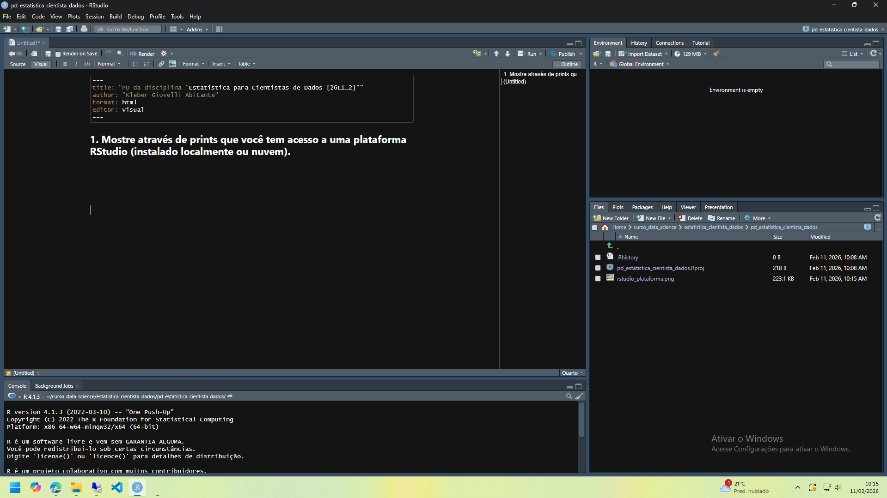
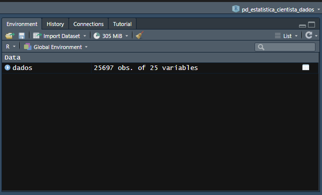

### Link do PD no RPubs: <https://rpubs.com/kleberga/pd_estat_cient_dados>

### 1. Mostre através de prints que você tem acesso a uma plataforma RStudio (instalado localmente ou nuvem).

## 

### 2. Escolha uma base de dados para realizar esse projeto. Essa base de dados será utilizada durante toda sua análise. Essa base necessita ter 4 (ou mais) variáveis de interesse. Caso você tenha dificuldade para escolher uma base, o professor da disciplina irá designar para você.

<br>

Resposta: a base escolhida foi uma base do Kaggle que contém arremessos (em jogos de basquete da NBA) realizados pelo falecido jogador Kobe Bryant. A base possui 30.697 arremessos, representados pelas linhas, e 25 variáveis, que estão nas colunas. O resultado da função *skim()* abaixo apresenta algumas informações sobre as variáveis.

```{r}
#| message: FALSE
library(tidyverse)
library(skimr)

# definir a vírgula como separador de decimal
options(OutDec = ",")
```

```{r}
# carregar os dados
dados <- read_delim("data.csv", delim=",", show_col_types = F)

# gerar algumas descricoes dos dados
skim(dados)
```

<br>

A seguir, é apresentada uma descrição de cada variável da base, segundo o Kaggle:

1.  **action_type**: diferentes tipos de arremesso (57 tipos diferentes);

2.  **combined_shot_type**: tipos gerais de arremesso (6 tipos diferentes);

3.  **game_event_id**: identificador de jogo. O Kaggle não deixa claro do que se trata esse campo, pois ele não é único, podendo se repetir em vários jogos;

4.  **game_id**: identificador único de cada jogo;

5.  **lat**: latitude da quadra em que o jogo ocorreu;

6.  **lon**: longitude da quadra em que o jogo ocorreu;

7.  **loc_x**: local no eixo-x da quadra de onde o arremesso foi feito (-250 = parte inferior direita da quadra até 250 = parte superior direita da quadra, onde a cesta está no centro do lado direito);

8.  **loc_y**: local no eixo-y da quadra de onde o arremesso foi feito (-40 = lado direito até 900 = lado esquerdo, onde a cesta está no centro do lado direito);

9.  **minutes_remaining**: minutos faltando para terminar o período (máximo de 12);

10. **period**: período do jogo (em geral, possui 4, mas podem ser mais em caso de empate);

11. **playoffs**: indicador se o jogo é de *playoffs* (1) ou não (0);

12. **season**: temporada da NBA em que o jogo ocorreu (1996-97 até 2015-16);

13. **seconds_remaining**: segundos faltando para terminar o período;

14. **shot_distance**: distância (em metros) de onde o arremesso foi feito;

15. **shot_type**: 2-pontos ou 3-pontos;

16. **shot_zone_area**: área da quadra de onde o arremesso foi feito (BC, C, LC, L, RC e R);

17. **shot_zone_basic**: zona da quadra de onde o arremesso foi feito (total de 7);

18. **shot_zone_range**: intervalo (em metros) de onde o arremesso foi feito (\<8, 8-16, 16-24, 24+ e fundo da quadra);

19. **team_id**: sempre 1610612747, que é o id do único time em que Kobe Bryant jogou (Los Angeles Lakers);

20. **team_name**: sempre Los Angeles Lakers;

21. **game_date**: data em que ocorreu o jogo;

22. **matchup**: id dos times que jogaram a partida;

23. **opponent**: id do time adversário;

24. **shot_made_flag**: indica se o arremesso teve êxito (1) ou não (0); e

25. **shot_id**: identificador único de cada arremesso.

Nota-se que há 10 colunas no formato de caracter, 1 coluna no formato de data e 14 colunas numéricas. As variáveis identificadoras (*game_event_id*, *game_id*, *team_id* e *shot_id*), apesar de terem sido carregadas como numéricas e terem as suas estatísticas descritivas calculadas anteriormente, as estatísticas não tem relevância, pois estas variáveis servem apenas para identificar os dados.

A única variável com valores faltantes (*NA*) é a variável *shot_made_flag*, que possui 5.000 valores faltantes. Isso decorre dessa base ter sido usada em uma competição de *machine learning,* na qual o objetivo era utilizar as demais variáveis para prever estes valores faltantes. Assim, para fins deste trabalho, essas observações foram excluídas, conforme o código abaixo.

```{r}
dados <- dados %>% drop_na()
```

### 3. Explique qual o motivo para a escolha dessa base e explique os resultados esperados através da análise.

<br>

Resposta: escolhi esta base porque acompanho jogos de basquete e acho interessante avaliar estatísticas esportivas. Eu espero, por meio da estatística descritiva, identificar:

-   Qual a distância da cesta em que Kobe Bryant mais arriscava arremessos; e

-   Se o aproveitamento dele mudava nos *playoffs* em comparação com a temporada regular.

### 4. Carregue a base para o RStudio e comprove o carregamento tirando um print da tela com a base escolhida presente na área "Ambiente"/Enviroment. Detalhe como você realizou o carregamento dos dados.

<br>

Resposta:



A base foi carregada da seguinte forma:

1.  Foi acessado o site contendo a base de dados: <https://www.kaggle.com/competitions/kobe-bryant-shot-selection/data>;

2.  Após efetuar login no site, o arquivo .zip foi baixado e descompactado na pasta do projeto do R na qual este trabalho foi desenvolvido;

3.  O arquivo foi aberto no Bloco de Notas e verificou-se que as colunas estavam separadas por vírgula. Assim, foi utilizada a função `read_delim()`, da coletânea de pacotes `tidyverse`, com o argumento `delim = ","`. O código completo utilizado para baixar os dados foi o seguinte:\
    `dados <- read_delim("data.csv", delim=",", show_col_types = F)`.

### 5. Instale e carregue os pacotes de R necessários para sua análise (mostre o código necessário):

**a. tidyverse**

**b. ggplot**

**c. summarytools**

<br>

Resposta:

```{r}
#| eval: false
install.packages("tidyverse")
install.packages("summarytools")
```

```{r}
#| message: FALSE
library(tidyverse)
library(summarytools)
```

### 6. Escolha outros pacotes necessários, aponte sua necessidade e instale e carregue (mostrando o código necessário).

<br>

```{r}
#| eval: false
install.packages("skimr")
install.packages("DT")
install.packages("patchwork")
install.packages("tseries")
install.packages("broom")
install.packages("corrplot")
```

```{r}
#| message: FALSE
library(skimr)
library(DT)
library(patchwork)
library(tseries)
library(broom)
library(corrplot)
```

Segue a explicação para utilização dos pacotes escolhidos:

-   pacote `skimr`: utilizado para identificação inicial das variáveis da base, seus respectivos formatos, estatísticas descritas e valores faltantes;

-   pacote `DT:` utilizado para geração de tabelas com melhor aspecto visual;

-   pacote `patchwork:` utilizado para compor dois gráficos na mesma imagem.;

-   pacote `tseries`: utilizado para calcular o teste de normalidade de algumas variáveis;

-   pacote `broom`: utilizado para capturar o resultado do teste de normalidade e transformá-lo em um data.frame para apresentação no relatório; e

-   pacote `corrplot`: utilizado para gerar o gráfico de correlação entre as variáveis numéricas.

### 7. Aplique uma função em R que seja útil para sua análise e mostre.

<br>

Resposta: o código a seguir tem por objetivo calcular o aproveitamento de Kobe Bryant nos arremessos da temporada regular (*playoffs* = 0) e nos *playoffs* (*playoffs* = 1), a fim de verificar se há diferença. O aproveitamento foi calculado na variável *proporcao_acertos*, que representa a razão entre o número de acertos e o número de arremessos tentados.

```{r}
# calcular o aproveitamento por identificador de playoff
dados_playoffs <- dados %>% 
  group_by(playoffs) %>% 
  summarise(
    total_shots = n(),
    total_shot_made_flag = sum(shot_made_flag),
    proporcao_acertos = round(total_shot_made_flag/total_shots * 100, 2)
    )

# criar a tabela
datatable(
  dados_playoffs,
  rownames = F,
  colnames = c(
    "Indicador de playoffs" = "playoffs",
    "Total de arremessos" = "total_shots",
    "Total de arremessos com sucesso" = "total_shot_made_flag",
    "Proporção de acertos (%)" = "proporcao_acertos"
  ),
  options = list(
    scrollX = TRUE,
    pageLength = 10,
    dom = 't'
  ),
)
```

<br>

Os resultados indicaram que o aproveitamento na temporada regular foi de 44,6%, ligeiramente acima do aproveitamento nos *playoffs* (44,5%). Essa diferença é pequena, mas pode ser decorrente do padrão de jogo dos *playoffs*, quando a defesa é mais intensa e os arremessos costumam ser mais contestados, reduzindo um pouco a eficiência.

### 8. Escolha uma variável de seu banco de dados e calcule:

**a. a média para todos os eventos**

**b. o desvio padrão**

**c. os quantis: 25% a 75%**

<br>

Resposta: conforme orientado em aula, foram calculadas as estatísticas citadas, além da mediana, para todas as variáveis numéricas. No caso da base em questão, há algumas variáveis numéricas que precisam ser removidas, pois o cálculo das estatísticas citadas não fazem sentido para elas:

1.  variáveis identificadoras: *game_event_id*, *game_id*, *team_id* e *shot_id*;

2.  variáveis numéricas categóricas (variáveis binárias, que representam categorias): *playoffs* e *shot_made_flag*; e

3.  variável *period* (períodos do jogo, em geral, de 1 a 4), que apesar de ser numérica, tem mais características de variável categórica, sendo os números apenas os rótulos das categorias.

O código abaixo gera a média, mediana, desvio padrão e os quantis 25% e 75% das variáveis numéricas.

```{r}
#| warning: False
#| message: false
#| 
# variáveis numéricas
variaveis_num <- c("lat", "loc_x", "loc_y", "lon", "minutes_remaining",
                   "seconds_remaining", "shot_distance")

# calcular a média, mediana, desvio-padrão, quantil 25% e quantil 75%
tabela_resumo <- dados %>% summarise(
  across(
    .cols = all_of(variaveis_num), 
    .fns = list(
      media = ~mean(.x, na.rm = T),
      mediana = ~median(.x, na.rm = T),
      quantil_25 = ~unname(quantile(.x, probs=c(0.25))),
      quantil_75 = ~unname(quantile(.x, probs=c(0.75)))
    ),
    .names = "{.col}..{.fn}"
  )
)

# converter para o fomato longo
tabela_vertical <- tabela_resumo %>%
  pivot_longer(cols = everything(), 
               names_to = c("Variavel", "Estatistica"), 
               names_sep = "\\.\\.",
               values_to = "Valor")

# converter o valor para 2 casas decimais
tabela_vertical <- tabela_vertical %>% mutate(Valor = round(Valor, 2))

# converter para o formato expandido
tabela_horizontal <- tabela_vertical %>% 
  pivot_wider(
    id_cols = Variavel, 
    names_from = Estatistica, 
    values_from = Valor)

# criar a tabela
datatable(
  tabela_horizontal,
  caption = htmltools::tags$caption(style = 'caption-side: top; text-align: center; color: black; font-weight: bold;', 'Estatísticas descritivas'),
  colnames = c(
    "Variável" = "Variavel",
    "Média" = "media",
    "Mediana" = "mediana",
    "Quantil 25%" = "quantil_25",
    "Quantil 75%" = "quantil_75"
  ),
  options = list(
    scrollX = TRUE,
    scrollY = "360px",
    pageLength = 10,
    dom = 't'
  ),
)
```

<br>

Também conforme orientação em aula, em se tratando das variáveis categóricas, foi apurada a quantidade de observações em cada categoria e a proporção do total. Foram retiradas, desta avaliação, as seguinte variáveis:

-   *team_name* (nome do time em que Kobe Bryant jogou), uma vez que não tem variabilidade, sendo sempre Los Angeles Lakers; e

-   *matchup* (id dos times que jogaram a partida), em razão desta variável já ser adequadamente representada pela variável *opponent* (id do time adversário), tendo em vista que o Kobe Bryant só jogou em time em sua carreira, de modo que em cada jogo há diferença apenas de oponente.

A variável *game_date* (data do jogo) foi mantida, sendo que os valores da coluna "Total" e "Proporção" para esta variável representam o total de arremessos naquela data e a proporção que os arremessos realizados naquela data representam do total de arremessos do jogador, respectivamente.

```{r}
# criar variáveis no formato caracter a partir das binárias
dados <- dados %>% mutate(
  playoffs_carac = ifelse(playoffs == 1, "playoffs", "not_playoffs"),
  shot_made_flag_carac = ifelse(shot_made_flag == 1, "success", "not_success"),
  period = as.character(period)
)

dados$game_date <- as.character(dados$game_date)

vars_interesse <- c("action_type", "combined_shot_type", "shot_type", 
                   "shot_zone_area", "shot_zone_basic", "shot_zone_range",
                   "opponent", "playoffs_carac", "shot_made_flag_carac", "season",
                   "game_date","period")

df_resumo <- dados %>%
  select(all_of(vars_interesse)) %>%
  # Transforma as colunas em linhas (Variavel | Categoria)
  pivot_longer(cols = everything(), names_to = "variavel", values_to = "categoria") %>%
  # Agrupa por ambos para contar
  group_by(variavel, categoria) %>%
  summarise(total = n(), .groups = "drop") %>%
  # Calcula a proporção dentro de cada variável original
  group_by(variavel) %>%
  mutate(proporcao = total / sum(total)) %>% 
  arrange(variavel, desc(proporcao)) %>% 
  ungroup()

datatable(df_resumo, 
          caption = htmltools::tags$caption(style = 'caption-side: top; text-align: center; color: black; font-weight: bold;', 'Resumo de Variáveis Categóricas'),
          colnames = c("Variável" = "variavel",
             "Categoria" = "categoria",
             "Total" = "total",
             "Proporção" = "proporcao"),
          options = list(scrollY = "400px", paging = FALSE, dom = 't')) %>%
  formatPercentage("Proporção", 2)
```

### 9. Utilizando o pacote summarytools (função descr), descreva estatisticamente a sua base de dados.

<br>

Resposta: a função `descr()` já remove, automaticamente, as variáveis não numéricas e calcula as estatísticas descritivas apenas para as demais. Foram excluídas, deste cálculo, as mesmas variáveis numéricas da questão anterior.

Antes de aplicar a função `descr()`, foi criada uma nova base de dados apenas com as variáveis numéricas cujas estatísticas descritivas têm significado, denominada `dados_num`, e a função `descr()` foi aplicada nela. O resultado é mostrado a seguir.

```{r}
# selecionar as variáveis numéricas mas excluir as variáveis identificadoras 
# e as variáveis categóricas
dados_num <- dados %>% select(
  lat, loc_x, loc_y, lon, minutes_remaining, seconds_remaining, shot_distance
)

# gerar estatísticas descritivas
est_descr <- descr(dados_num)

# arredondar para duas casas decimais
est_descr <- round(est_descr, 2)

# criar uma tabela com scroll
datatable(
  est_descr,
  caption = htmltools::tags$caption(style = 'caption-side: top; text-align: center; color: black; font-weight: bold;', 'Resultado da função "descr()"'),
  options = list(
    scrollX = TRUE,
    scrollY = "450px",
    pageLength = 10,
    dom = 't'
  ),
)
```

### 10. Escolha uma variável e crie um histograma. Justifique o número de bins usados. A distribuição dessa variável se aproxima de uma "normal"? Justifique.

<br>

Resposta: conforme informado durante a aula, foi elaborado o histograma de todas as variáveis numéricas e que não representem categorias (as mesmas variáveis utilizadas na questão anterior). O número de *bins (k*) foi escolhido por meio da estatística de Freedman-Diaconis, conhecida por ser mais robusta para distribuições assimétricas, que consiste no seguinte cálculo:

$k = \frac{max(x) - min(x)}{h}$

onde:

$h = 2\frac{IQR}{n^{1/3}}$

*IQR* é o intervalo interquartil e *n* é o número de observações.

O código a seguir cria duas funções:

-   a função *plotar_graf_normal*, que calcula a estatística de Freedman-Diaconis (variável *bins_fd*) e, em seguida, gera o histograma e o gráfico QQ-*plot*; e

-   a funçao *gerar_est_descr*, que gera as estatísticas descritivas de uma variável.

```{r}
# função para gerar o histograma
plotar_graf_normal <- function(base_dados, var){
  
  variavel <- rlang::enquo(var)
  dados_vetor <- base_dados %>% pull(!!variavel)

  # calcular o número de bins segundo a estatística de Freedman-Diaconis
  bins_fd <- nclass.FD(dados_vetor)
  
  plt1 <- base_dados %>% ggplot(aes(x = !!variavel)) +
    geom_histogram(
      aes(y = after_stat(density)),
      fill = "lightgrey",
      color = "black",
      alpha = 0.7,
      bins = bins_fd
    ) + 
    geom_density(color = "darkblue", linewidth = 1.1) +
    scale_color_manual(values = c("Média" = "blue")) +
    theme_minimal() +
    labs(
      title = paste0("Distribuição - ", rlang::as_name(variavel)),
      x = rlang::as_name(variavel),
      y = "Frequência"
    ) + 
    guides(color = guide_legend(title = NULL)) +
    geom_vline(
      aes(xintercept = mean(!!variavel), color = "Média"),
      linewidth = 1.1
      ) +
    theme(
      plot.title = element_text(face="bold")
    )
  
  plt2 <- base_dados %>% 
    ggplot(aes(sample = !!variavel)) +
    stat_qq(size = 2, alpha = 0.7) +
    stat_qq_line(color = "blue", linewidth = 1) +
    theme_minimal() +
    labs(
      title = paste0("QQ plot - ", rlang::as_name(variavel)),
      x = "Quantis Teóricos (Normais)",
      y = "Quantis amostrais"
    ) +
    theme(
      plot.title = element_text(face="bold")
    )
  
    # colocar um gráfico em cima do outro
    plt1 / plt2
}

# função para gerar as estatísticas descritivas
gerar_est_descr <- function(base_dados, var){

  variavel <- rlang::enquo(var)
  dados_filtrados <- base_dados %>% select(!!variavel)
  tab <- summarytools::descr(dados_filtrados)
  tab <- round(tab, 2)
  
  datatable(
    tab,
    colnames = NULL,
    options = list(
      scrollX = TRUE,
      scrollY = "450px",
      pageLength = 10,
      dom = 'tp'
    ),
    width = 300,
    #caption = paste0("Estatísticas descritivas - ", rlang::as_name(variavel))
    # caption =htmltools::HTML(
    #         paste0("<span style='font-weight: bold;'>
    #         Estatísticas descritivas - ",rlang::as_name(variavel),"</span>")
    #       )
    caption = htmltools::tags$caption(
      style = 'caption-side: top; text-align: center; color: black; font-weight: bold;', paste0('Estatísticas descritivas - ', rlang::as_name(variavel)),
  )
  )
}
```

<br>

A seguir, são gerados o histograma e o QQ-*plot* da variável *shot_distance* e, na sequência, o sumário estatístico.

```{r}
plotar_graf_normal(dados, shot_distance)
```

```{r}
gerar_est_descr(dados, shot_distance)
```

<br>

Os dois gráficos mostram que a variável *shot_distance* não segue distribuição "normal". A mediana de *shot_distance* é 15 (AIQ: 5-21).

A seguir, são apresentados os gráficos e as estatísticas descritivas da variável *lat*.

```{r}
plotar_graf_normal(dados, lat)
```

```{r}
gerar_est_descr(dados, lat)
```

<br>

A variável *lat* também não apresenta distribuição "normal", com base nos gráficos anteriores. A mediana da variável *lat* é 33,97 (AIQ: 33,88-34,04).

Na sequência, são apresentados os gráficos e as estatísticas descritivas da variável *lon*.

```{r}
plotar_graf_normal(dados, lon)
```

```{r}
gerar_est_descr(dados, lon)
```

<br>

A variável *lon*, apesar de apresentar bom nível de simetria, possui caldas muito longas, diferente do formato da "normal". O gráfico QQ-*plot* também mostra que a série aparenta ser "normal" nos quantis teóricos próximos de zero, mas se afasta da normalidade nos extremos inferior e superior.

Para auxiliar na identificação da normalidade, também foi realizado o teste de Jarque-Bera para esta série, o qual tem como hipótese nula que a série segue a distribuição "normal". O código abaixo cria uma função para calcular o teste e, em seguida, a função é chamada para a variável *lon*. O resultado permite rejeitar a hipótese nula ao nível de significância de 5%. Portanto, realmente a variável *lon* não segue distribuição "normal".

```{r}
test_jarque <- function(base, var){
  
  variavel <- rlang::enquo(var)
  dados_vetor <- base %>% pull(!!variavel)
  
  res_js <- jarque.bera.test(dados_vetor)

  tabela <- broom::tidy(res_js)
  
  datatable(
    tabela,
    rownames = F,
    caption = htmltools::tags$caption(
      style = 'caption-side: top; text-align: center; color: #2c3e50; font-weight: bold; font-size: 18px;',
      paste0('Resultado do Teste de Normalidade Jarque-Bera - ', rlang::as_name(variavel))
    ),
    colnames = c("Estatística (X-squared)", "p-valor", "Graus de Liberdade", "Método"),
    options = list(dom = 't', paging = FALSE, ordering = FALSE) # Remove excesso de UI para uma tabela simples
  ) %>% formatRound(columns = c("statistic", "p.value"), digits = 4)
}
```

```{r}
test_jarque(dados, lon)
```

<br>

A mediana da variável *lon* é -118,27 \[AIQ: -118.34-(-118,18)\].

A seguir, são apresentados os gráficos e as estatísticas descritivas da variável *loc_x*.

```{r}
plotar_graf_normal(dados, loc_x)
```

```{r}
gerar_est_descr(dados, loc_x)
```

<br>

A variável *loc_x* também possui histograma relativamente simétrico e, no gráfico QQ-*plot*, ela se distancia da normalidade nos extremos inferior e superior. Para complementar a análise, também foi calculado o teste de Jarque-Bera para esta variável (resultado abaixo), o qual rejeitou a hipótese nula de normalidade, indicando que a variável não segue distribuição "normal".

```{r}
# realiza o teste de Jarque-bera
test_jarque(dados, loc_x)
```

<br>

A mediana da variável *loc_x* é 0 (zero) (AIQ: -67-94). As estatísticas descritivas desta variável repondem um dos objetivos do trabalho, que era identificar qual a distância da cesta em que Kobe Bryant mais arriscava arremessos. A mediana igual a zero indica que ele arriscava mais quando estava próximo ou junto da cesta.

Na sequência, são apresentados os gráficos e as estatísticas descritivas de *loc_y*.

```{r}
plotar_graf_normal(dados, loc_y)
```

```{r}
gerar_est_descr(dados, loc_y)
```

<br>

Os gráficos mostram nitidamente que a variável *loc_y* não segue distribuição "normal". A mediana de *loc_y* é 74 (AIQ: 4-160).

A seguir, são apresentados os gráficos e as estatísticas descritivas de *minutes_remaining*.

```{r}
plotar_graf_normal(dados, minutes_remaining)
```

```{r}
gerar_est_descr(dados, minutes_remaining)
```

<br>

Com base nos gráficos, a variável *minutes_remaining* também não apresenta distribuição "normal". A mediana de *minutes_remaining* é 5 (AIQ: 2-8).

Por fim, são apresentados na sequéncia os gráficos e as estatísticas descritivas da variável *seconds_remaining*.

```{r}
plotar_graf_normal(dados, seconds_remaining)
```

```{r}
gerar_est_descr(dados, seconds_remaining)
```

<br>

Os gráficos de *seconds_remaining* indicam que a variável não segue distribuição "normal". A mediana de *seconds_remaining* é 28 (AIQ: 13-43).

### 11. Calcule a correlação entre todas as variáveis dessa base. Quais são as 3 pares de variáveis mais correlacionadas?

<br>

Resposta: para esta questão, foi calculada a correlação de Pearson entre as variáveis numéricas, que estão na base `dados_num`. Os resultados são mostrados abaixo.

```{r}
# calcular a correlação de pearson
matriz_cor <- cor(dados_num, use = "complete.obs")

# gerar o gráfico com as correlações
corrplot(matriz_cor, method = "color", tl.col = "black", type="upper",
         addCoef.col = "black", number.cex = 0.7,
         title = "Gráfico de correlações",
         mar = c(0, 0, 2, 0),
         tl.srt = 45
         )
```

<br>

A tabela anterior mostra que a correlação entre as variáveis *lat* e *loc_y* e *lon* e *loc_x* é perfeita (-1 e 1, respectivamente). Isso indica redundância total, onde ambos os pares descrevem a mesma localização geográfica em sistemas de coordenadas diferentes. Para simplificar a base, optou-se por eliminar as variáveis *lat* e *lon*, conforme demonstrado no código abaixo. Com isso, a base *dados_num* foi refeita, assim como as correlações.

```{r}
# eliminar as colunas desnecessaria
dados <- dados %>% select(-lat, -lon)

# selecionar as variáveis numéricas mas excluir as variáveis identificadoras e as
# variáveis categóricas
dados_num <- dados %>% select(
  loc_x, loc_y, minutes_remaining, seconds_remaining, shot_distance
)

# calcular a correlação de pearson
matriz_cor <- cor(dados_num, use = "complete.obs")

# gerar o gráfico com as correlações
corrplot(matriz_cor, method = "color", tl.col = "black", type="upper",
         addCoef.col = "black", number.cex = 0.7,
         title = "Gráfico de correlações",
         mar = c(0, 0, 2, 0),
         tl.srt = 45
         )
```

<br>

O resultado indicou que os três pares de maior correlação foram:

1.  *shot_distance* e *loc_y* (0,82). A correlação é alta e positiva. Indica que a distância do arremesso está positivamente correlacionada com a localização no eixo-y da quadra em que o arremesso ocorreu. Quanto maior a distância do arremesso, maior a localização no eixo-y em que o arremesso foi realizado. Dada a relação entre a distância do arremesso e a posição na quadra, esta alta correlação era esperada;

2.  *minutes_remaining* e *loc_y* (-0,08). A correlação mostra que conforme os minutos para terminar o período de jogo diminuem (ou seja, o fim do período se aproxima), a posição do arremesso no eixo-y da quadra aumenta. Esta correlação faz sentido: quando o período de jogo se aproxima do fim, especialmente no último período de jogo, o time em desvantagem precisa arriscar mais para tentar reverter o placar. Mas a tendência é fraca, pois a correlação é próxima de zero; e

3.  *minutes_remaining* e *shot_distance* (-0,06). A correlação mostra que, conforme os minutos para terminar o período de jogo diminuem, a distância dos arremessos aumenta. Esta correlação faz sentido, sendo que a explicação é a mesma do item anterior. Mas a correlação também é fraca, em razão de ser próxima de zero.

### 12. Crie um scatterplot entre duas variáveis das resposta anterior. Qual a relação da imagem com a correlação entre as variáveis.

<br>

Resposta: foram escolhidas as variávels *shot_distance* e *loc_y* para elaboração do *scatterplot*, conforme apresentado abaixo.

```{r}
#| warning: False
#| message: False
ggplot(dados, aes(x=shot_distance, y=loc_y)) +
  geom_point() + 
  geom_smooth(alpha = 0.4, se = F, color="blue", method = "lm") +
  ggtitle("Scatterplot entre 'shot_distance' e 'loc_y'") +
  theme(
    plot.title = element_text(face = "bold")
  ) +
  theme_minimal() +
    theme(
    legend.position = "bottom",
    plot.title = element_text(face = "bold")
  )
```

O gráfico de dispersão confirma uma correlação positiva forte entre as variáveis (0,82), representada por uma inclinação ascendente constante. Na prática, isso indica que o aumento na coordenada vertical (`loc_y`) é o principal fator para o aumento da distância total do arremesso (`shot_distance`). Essa relação sugere que a distância é altamente dependente da posição do jogador em relação à linha de fundo da quadra, que faz sentido e era esperado.

### 13. Crie um gráfico linha de duas das variáveis. Acrescente uma legenda e rótulos nos eixos.

<br>

Resposta: as variáveis escolhidas foram *loc_x* e *loc_y*. Como a base de dados possui 25.697 observações, optou-se por utilizar apenas as primeiras 100 observações para criação do gráfico, a fim de permitir melhor visualização dos dados (o gráfico foi elaborado inicialmente com todas as observações e se tornava impossível ver as linhas). O gráfico é apresentado abaixo.

```{r}
ggplot(dados[c(1:100),]) +
  geom_line(aes(y = loc_y, x=c(1:nrow(dados[c(1:100),])), group=1, 
                color = "Localização Y (loc_y)")) +
  geom_line(aes(y = loc_x, x=c(1:nrow(dados[c(1:100),])), group=1, 
                color = "Localização X (loc_x)")) +
  scale_color_manual(values = c("Localização Y (loc_y)" = "red", 
                                "Localização X (loc_x)" = "blue")) + 
  labs(color = NULL, title = "Gráfico de 'loc_x' e 'loc_y'", 
       x = "Observação", y = "Valor") +
  theme_minimal() +
  theme(
    legend.position = "bottom",
    plot.title = element_text(face = "bold")
    )
```
